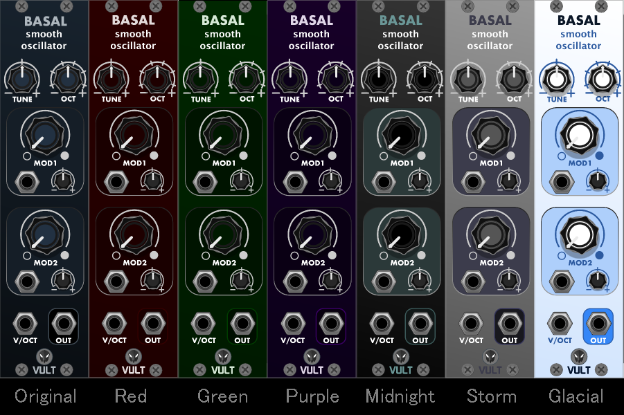

# VCV-Skins
A repository of skins for various modules for VCV Rack

For the instructions below, the Vult Free modules plugin is used as an example, but the process is the same for all skin packs.

Installation:
-------------

1) Download the folders and place them in the ../Rack/plugins/VultModulesFree/ folder.
2) Make a backup of the entire ../Rack/plugins/VultModulesFree/res folder as res_-_blue
3) rename the folder of the skin you wish to use as just ../Rack/plugins/VultModulesFree/res
4) restart VCV rack and the vult modules will use the new skin.

Removal:
--------

1) If you are using a skin currently, rename the ../Rack/plugins/VultModulesFree/res folder to anything you like
2) rename the original backup folder you made back to ../Rack/plugins/VultModulesFree/res
3) delete unwanted skin folders.

