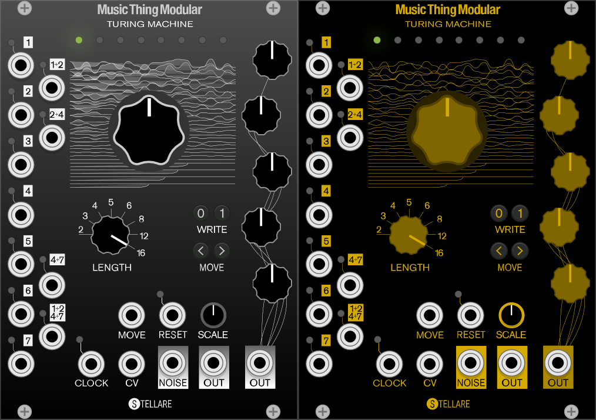

In order for the plugs to appear as they do in the screens...

In vcv rack, the .svg files for the default i/o jacks are in

VCV/Rack/res/ComponentLibrary

Just grab the jack.cvg from the vult modules plugin (or find any other one you like) and copy it.

Make backups of PJ301M.svg and PJ3410.svg

copy the jack.svg twice, renaming it to both of those files.

Enjoy the realistic looking i/o jacks.
